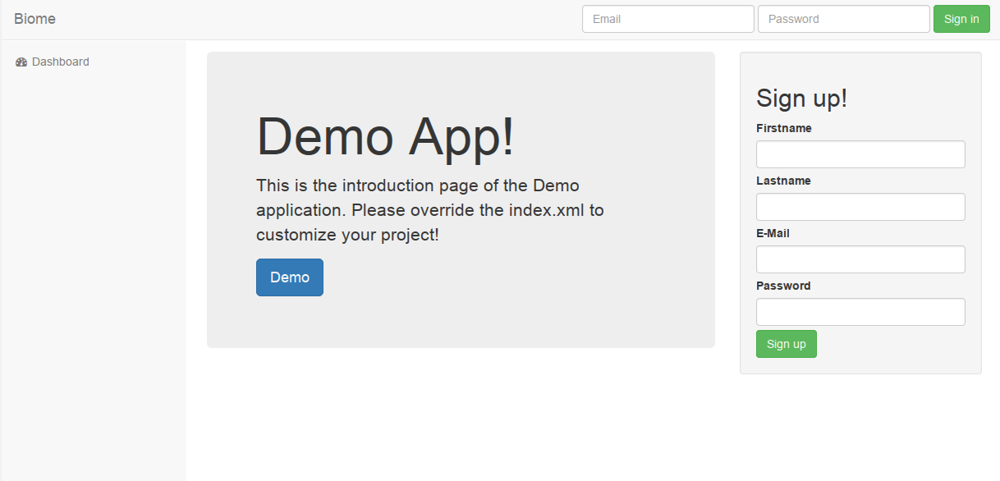
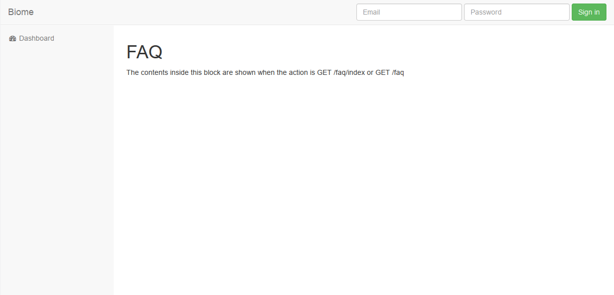
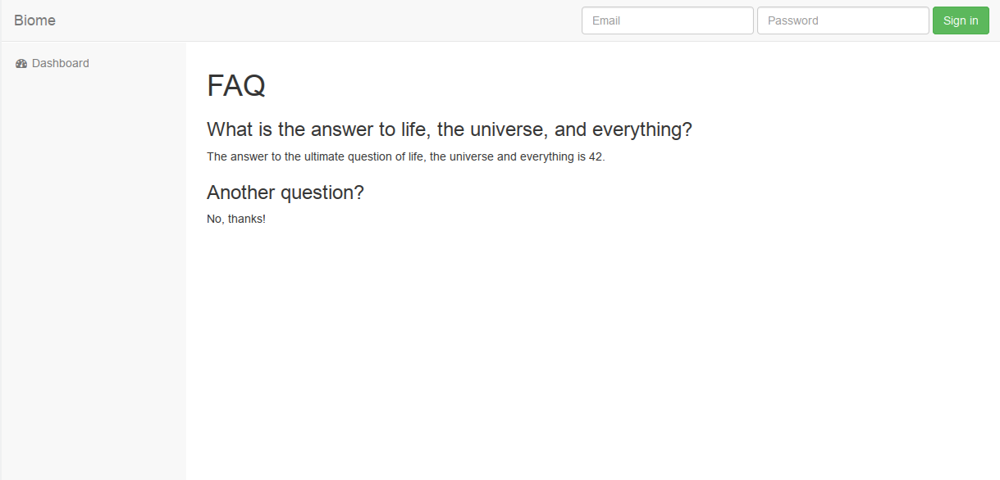

.. gettingstarted:

Getting started
***************

In this part you will be able to run your first web application, and understand the basic features of the Biome framework.

Welcome
=======

What is Biome?
--------------

Biome is a framework written in PHP focused on information systems web application.

It is used to build referential, ticketing, logistic or any others data-relationship application.

The goal of this framework
--------------------------

The main goal of this framework is to be able to develop web applications faster.

Companies need to move fast, and most of the time, a web application can increase the speed of communication inside
a company. But having the perfect application that will fit the needs is not an easy task. That's why, Biome was developed
to test the requirements faster and move faster to the solution that will fit the needs.

This framework is inspired by JSF (Java Server Faces) and an awesome framework developed internally by a french company
called Free SAS.

Quick-start guide
=================

In order to start our first project, we will retrieve the sample application.

Retrieve the sample project
---------------------------

We retrieve the sample application from the Github repository

.. code-block:: console

    $ git clone http://github.com/mermetbt/biome-application.git MyApp
    $ cd ~/MyApp
    $ composer install

**git clone** will retrieve the content of the application. And then, go to the application directory just created and install
all the dependencies with **composer install**.

Composer will install all the PHP dependencies, and also the javascript dependencies. It will compile the CSS and the
javascript to obtain minified files. Make sure you have at least **npm** installed on your computer.

Setup your webserver
--------------------

The webserver should be configured to reach the ``public/`` folder of your project. This public folder contains the ``index.php`` which
is the starting point of the application, and an ``.htaccess`` file which will set the URL rewriting (in case you are using Apache
as web server).

If you are using nginx or any other webserver, you should look at the documentation of this webserver and setup your webserver
to obtain the same behavior.

Make sure the ``storage/`` folder can be written by the webserver's user.

Setup your database configuration
---------------------------------

The sample application contains an ``.env.example`` file. Rename this file to ``.env`` and define the environment variables
inside to your configuration.

.. code-block:: console

	$ cat .env
	DB_HOSTNAME=localhost
	DB_USERNAME=root
	DB_PASSWORD=
	DB_DATABASE=myapp

* **DB_HOSTNAME** The MySQL hostname
* **DB_USERNAME** The user of your MySQL database
* **DB_PASSWORD** The password associated to the user
* **DB_DATABASE** The database name

.. TODO: Show table creation

Enjoy!
------

Now, at this step you should be able to view your new web application!

Connect to your application url, in my case ``http://localhost/myapp/``

Directory structure
===================

::

	app/
	    collections/
	    commands/
	    components/
	    controllers/
	    models/
	    views/
	    start.php
	public/
	    .htaccess
	    index.php
	resources/
	    css/
	    fonts/
	    images/
	    js/
	    less/
	storage/
	    cache/
	    logs/
	tests/
	    src/
	    bootstrap.php
	.env.example
	biome.php
	composer.json
	gulpfile.js
	phpunit.xml

Command Line Interface (CLI)
============================

Make sure the file ``biome.php`` is executable and type

.. code-block:: console

	$ ./biome.php

The output will be something like

.. code-block:: console

	Biome Shell version development

	Usage:
	  command [options] [arguments]

	Options:
	  -h, --help            Display this help message
	  -q, --quiet           Do not output any message
	  -V, --version         Display this application version
	      --ansi            Force ANSI output
	      --no-ansi         Disable ANSI output
	  -n, --no-interaction  Do not ask any interactive question
	  -v|vv|vvv, --verbose  Increase the verbosity of messages: 1 for normal output, 2 for more verbose output and 3 for debug

	Available commands:
	  help                      Displays help for a command
	  list                      Lists commands
	  database
	    database:showCreateTable  Print SQL code needed to create all the tables corresponding to the models.
	  object
	    object:create             Create a new object with all the necessary files.
	  rights
	    rights:createAdminRole    Create the Administrator role with all the access rights.
	    rights:setAdmin           Set the an user as administrator.
	  routes
	    routes:listRoutes         List all the routes.
	  test
	    test:demo                 My demonstration command

Creating pages
==============

Now, it's time to go further and create your own pages.

Create your first page
----------------------

In this example, we will add a FAQ page to the sample application.

For this purpose we will create the new endpoints ``GET /faq`` by creating a new controller and a default action. Then we will
create the view that will show the contents of the FAQ page.

Create controller
^^^^^^^^^^^^^^^^^

The controller will allow us to define the routing inside the app. The route is defined by the controller name, the action
name and the prefix of the function that will handle the action. The prefix corresponds to the HTTP method used to reach this
route.

In the following example, the route will be ``GET /faq`` and ``GET /faq/index``, let's create a new file at this location
``app/controllers/FAQController.php``:

.. code-block:: php

	<?php

	use Biome\Core\Controller;

	/**
	 * FAQ Controller
	 */
	class FAQController extends Controller
	{
		/**
		 * Main action : GET /faq or GET /faq/index
		 */
		public function getIndex()
		{

		}
	}

As you can see, the controller name is suffixed by ``Controller``, it's important to let the framework knows which type of
object he's manipulating. We will not do any treatment inside the action, so we just declare the function that will create
the route ``index``.

``index`` is the default action when there is no action defined in the URL.

Create view
^^^^^^^^^^^

Then, as we create the ``GET /faq`` endpoint, we need to setup the view associated to this endpoint.

Create a file ``app/views/faq.xml``, you can notice that the filename corresponds to the controller name:

.. code-block:: xml

	<?xml version="1.0" encoding="UTF-8"?>
	<biome:views xmlns:biome="http://github.com/mermetbt/Biome/">

		<!-- Include the top bar and the side bar of the demo application -->
		<biome:include src="elements/navbar.xml"/>

		<biome:view action="index">
			<h1>FAQ</h1>
			

				The contents inside this block are shown when the action is GET /faq/index or GET /faq
			

		</biome:view>

	</biome:views>

In this example, you can see that the component ``view`` in the namespace ``biome`` has an attribute ``action``. This is
where the content has to be defined. You can have many ``view`` inside the ``views`` component to handle different actions.

You can notice that the view file can contains XML and HTML markup.

If you try to reach the endpoint ``GET /faq``, in my case corresponding to this URL in my
browser: ``http://localhost/myapp/faq`` (take care to remove the trailing slash).
You should see:

Retrieving data inside the page
-------------------------------

Now, it's better if we can show content retrieved from a database instead of updating the view everytime. So, let's create
a model.

Create a model
^^^^^^^^^^^^^^

The model is the link between the database engine (here MySQL) and the object representation in PHP. In order to define a
model class, we have to extends the ``Models`` class and create 2 methods: ``parameters`` and ``fields``.

The ``parameters`` method return an array containing the meta informations about the database, at least the table name and
the primary key name.

The ``fields`` method is called by Biome when an instance of the class is created. This method is used to define the fields
of the object. The name corresponds to the column inside the database.

All the application models are stored in the ``app/models`` folder. You can create the file ``Question.php`` as follow:

.. code-block:: php

	<?php

	use Biome\Core\ORM\Models;

	use Biome\Core\ORM\Field\PrimaryField;
	use Biome\Core\ORM\Field\TextField;
	use Biome\Core\ORM\Field\TextAreaField;

	class Question extends Models
	{
		public function parameters()
		{
			return array(
				'table'         => 'questions',
				'primary_key'   => 'question_id'
			);
		}

		public function fields()
		{
			$this->question_id = PrimaryField::create()
						->setLabel('@string/question_id');

			$this->question    = TextField::create(255)
						->setLabel('@string/question');

			$this->answer      = TextAreaField::create()
						->setLabel('@string/answer');
		}
	}

In this case, we use 3 types of field:

* **PrimaryField** which correspond to the primary key field
* **TextField** which correspond to a ``VARCHAR(255)`` column inside the database
* **TextAreaField** which correspond to a ``TEXT`` column inside the database

Don't forget to create the table ``questions`` inside the database!

.. code-block:: sql

	CREATE TABLE `questions` (
		`question_id` INT unsigned AUTO_INCREMENT PRIMARY KEY,
		`question` VARCHAR(255) NOT NULL,
		`answer` TEXT NOT NULL
	);

You can notice that the labels are defined with string looking like ``@string/answer``, this is used for the translation. The
string ``answer`` has to be defined inside the ``string.xml`` located in the ``resources`` folder.

Create a collection
^^^^^^^^^^^^^^^^^^^

In this example, we will create a collection. Another solution can be to pass the content to the view directly from the
action method of the controller. I choose to create a collection to demonstrate the process.

All the application collections are stored in the ``app/collections`` folder. You can create the file ``RequestCollection.php`` as follow:

.. code-block:: php

	<?php

	use Biome\Core\Collection\RequestCollection;

	class QuestionsCollection extends RequestCollection
	{
		/**
		 * Definition of the items of the collection.
		 */
		protected $map = array(
			'questions' => array()
		);

		/**
		 * This method populate the questions array of the collection.
		 */
		public function getQuestions()
		{
			/* Return all the question from the database. */
			return Question::all();
		}
	}

The items of a collection are stored in the scope of the collection.

A collection can have different scope, here it's the **request** scope because the collection extends the ``RequestCollection``.
There is also the **session** scope with the ``SessionCollection``. The last one is used by the demo ``AuthCollection`` to keep
the authenticated user in the session.

Update the view
^^^^^^^^^^^^^^^

Now, we can update the ``faq.xml`` file to show the content retrieved from the collection.

.. code-block:: xml

		...
		<biome:view action="index">
			<h1>FAQ</h1>
			<biome:loop value="#{questions.questions}" var="q">
				<h2><biome:variable value="#{q.question}"/></h2>
				

					<biome:variable value="#{q.answer}"/>
				

			</biome:loop>
		</biome:view>
		...

We use the ``Loop`` component to iterate over the result. This component takes an attribute ``value`` which contain an
interesting string ``#{questions.questions}``. This string tell the framework to fetch the variable (``#{variable_name}``) of
name ``questions.questions``. In our case the collection ``questions`` and his item ``questions``.

The ``Loop`` component takes a variable which can be an array or an extends of ``QuerySet`` and for each iteration define a
local variable defined by the ``var`` attribute which will contain an instance of our model.

Then we can obtain the content of our model by using the ``Variable`` component to basically print the value.

Populate some data directly inside the database, and here is the result:

Manipulating an object
----------------------
